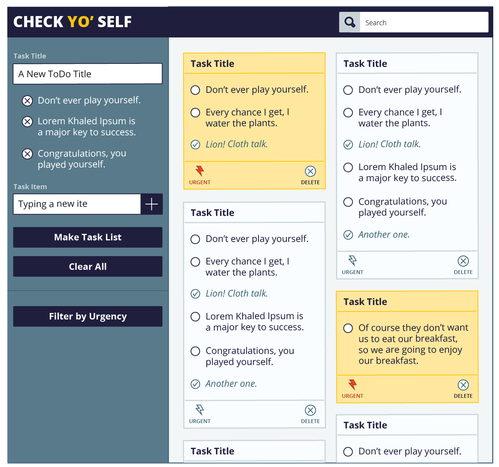
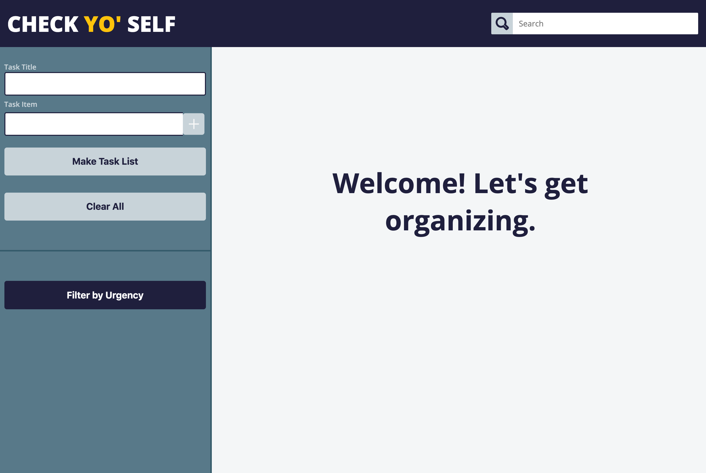
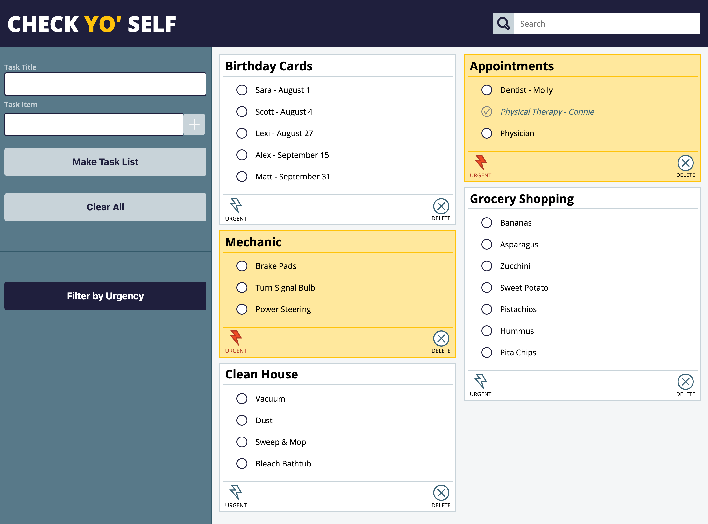
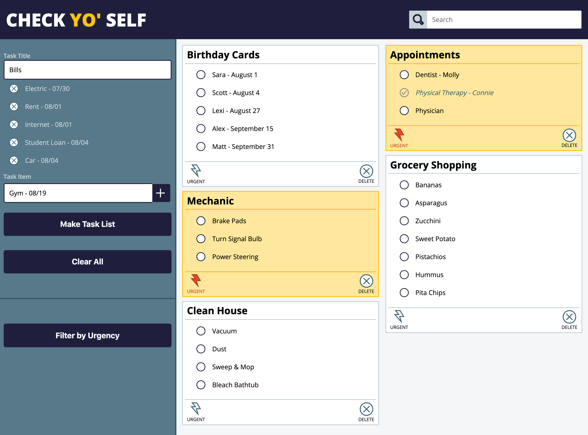
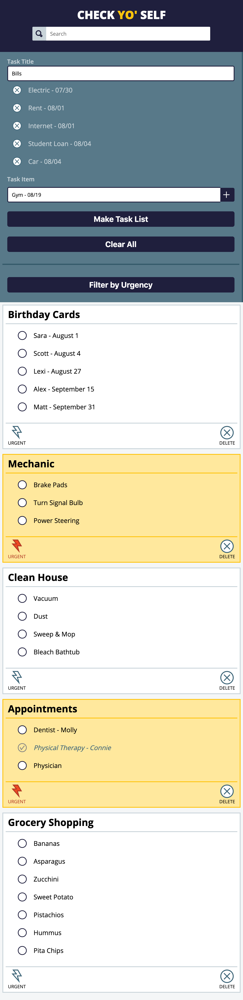

# Check Yo' Self

## General Info

A project to further solidify my understanding of vanilla JavaScript in Turing's Front-End Engineering course, Module 1.
Repository can be found <a href="https://github.com/vrandall66/Check-Yo-Self">here</a> and the project specs can be found <a href="https://frontend.turing.io/projects/check-yo-self.html">here</a>. The live page can be accessed <a href="https://vrandall66.github.io/Check-Yo-Self/">here</a>.

##  

#### By [Vanessa Randall](https://github.com/vrandall66)

## Built With

- HTML5
- CSS3
- Javascript ES5 & some ES6

## Screenshots

Provided comps:

My recreation of the provided comps:

## Features

- [x] Display multiple ToDo items with individual tasks
- [x] Once all items on a ToDo list have been checked off, the ToDo list can be deleted
- [x] ToDo lists and task items are saved in local storage
- [x] Fully functioning mobile version
